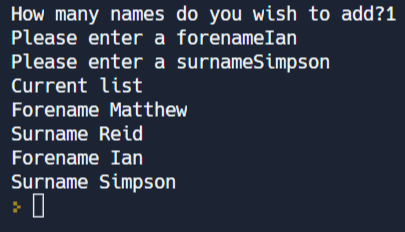

The sequential version of this program is:

```python:
nameList = [["Matthew","Reid"]]
numNames = int(input("How many names do you wish to add?"))
for names in range(numNames):
  newForename = str(input("Please enter a forename"))
  newSurname = str(input("Please enter a surname"))
  nameList.append([newForename, newSurname])

print("Current list")
for loop in range(len(nameList)):#
  print("Forename",nameList[loop][0])
  print("Surname",nameList[loop][1])

```

# Task 1

`main.py` contains modular code.

The `def` keyword sets up a user-defined function as shown:

```python:
def displayNames(nameList):
  print("Current list")
  for loop in range(len(nameList)):
    print("Forename",nameList[loop][0])
    print("Surname",nameList[loop][1])
```

The function can be **called** using the following line of code:

```python:
displayNames(nameList)
```

Place this line of code in the correct location so that the program runs and displays results similar to the following image:


